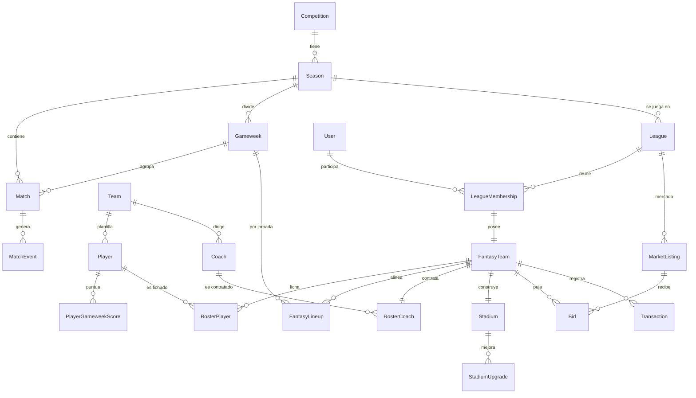

# 06 — Modelo de dominio

> Mapa del dominio de Gambetea. **La fuente de verdad es el esquema Prisma**
> ([`../apps/api/prisma/schema.prisma`](../apps/api/prisma/schema.prisma)); este documento
> da la visión de conjunto, las reglas y el ERD. Decisiones de modelado en
> [`../adr/ADR-006.md`](../adr/ADR-006.md). (Sprint 1.)

---

## Contextos (bounded contexts)

| Contexto | Qué contiene | Poblado por |
|----------|--------------|-------------|
| **Football Data** | Espejo de la realidad: `Competition, Season, Team, Player, Coach, Match, MatchEvent, Appearance, Injury, Suspension`. | Data Hub (proveedor `mock`→API) |
| **Anticorrupción** | `ProviderMapping` (IDs externos ↔ internos). | Data Hub |
| **Jornadas** | `Gameweek` (jornada del juego, vinculada a `Match`). | Data Hub / motor |
| **Identidad & Ligas** | `User, League, LeagueMembership`. | La app |
| **Juego Fantasy** | `FantasyTeam, RosterPlayer, FantasyLineup(+Slot), PlayerGameweekScore, FantasyGameweekScore`. | La app / motor |
| **Entrenadores** | `RosterCoach, CoachGameweekScore`. | La app / motor |
| **Estadio** | `Stadium, StadiumUpgrade`. | La app |
| **Mercado & Economía** | `MarketListing, CoachListing, Bid, Transaction`. | La app |

## ERD (núcleo)

## Reglas de modelado (clave)

1. **IDs internos (`cuid`) en todo.** Los IDs del proveedor nunca se usan aguas abajo; se
   guardan solo en `ProviderMapping (provider, entityType, externalId → internalId)`.
   → cumple el Football Data Hub (ADR-001).
2. **Separación realidad / juego.** El contexto *Football Data* es un **espejo de solo
   lectura** de la realidad (lo escribe el Data Hub). El resto (equipos Fantasy, mercado…)
   es estado del juego que escribe la app. Nunca se mezclan responsabilidades.
3. **Ciclo de jornada** (`Gameweek.status`): `UPCOMING → OPEN → LOCKED → FINISHED`. La
   alineación se puede editar en `OPEN`; al `LOCKED` se congela; en `FINISHED` se han
   calculado los `*GameweekScore` (ADR-008).
4. **Puntuación en dos niveles.** `PlayerGameweekScore` (puntos del jugador real, de eventos)
   y `FantasyGameweekScore` (agregado del equipo Fantasy). Igual para entrenadores.
5. **Dinero**: euros enteros (`Int`) con signo en `Transaction`. Cada movimiento económico
   deja rastro en `Transaction` (auditable).
6. **Tres pilares como entidades propias**: jugadores (`RosterPlayer`), entrenadores
   (`RosterCoach` + `CoachGameweekScore`), estadio (`Stadium` + `StadiumUpgrade`).

## Estable vs. provisional

- **Estable** (Sprints 2-7): Football Data, ProviderMapping, Gameweek, Identidad & Ligas,
  Juego Fantasy (equipo/plantilla/alineación/puntuación).
- **Provisional** (se refina en su sprint/ADR): detalle de **puntuación** (ADR-008),
  **economía/mercado** (ADR-009), **algoritmo de entrenadores** (ADR-010), **balance del
  estadio** (ADR-011). Sus tablas ya existen para dar coherencia, pero sus campos/reglas
  pueden evolucionar con migraciones.
